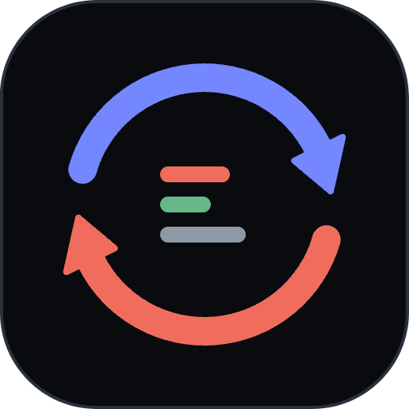
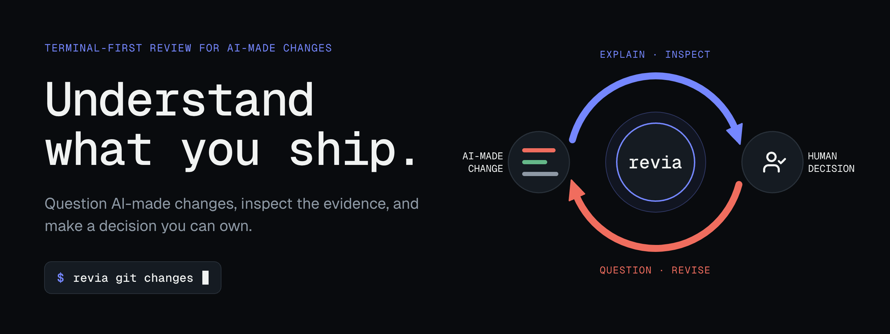
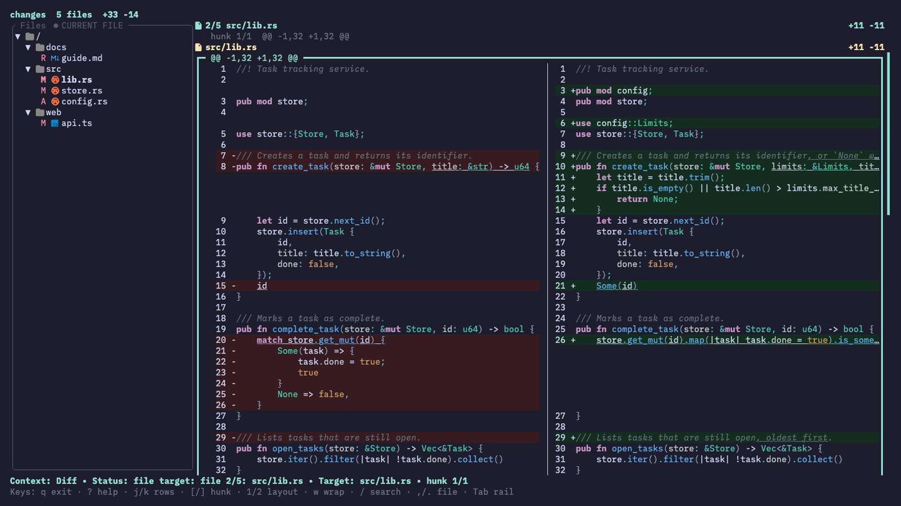
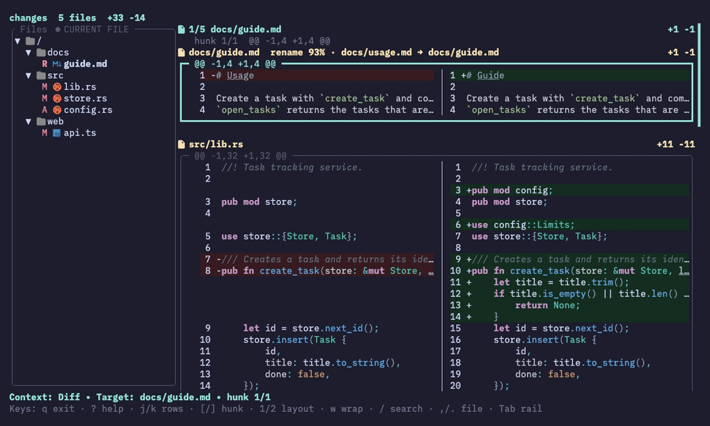
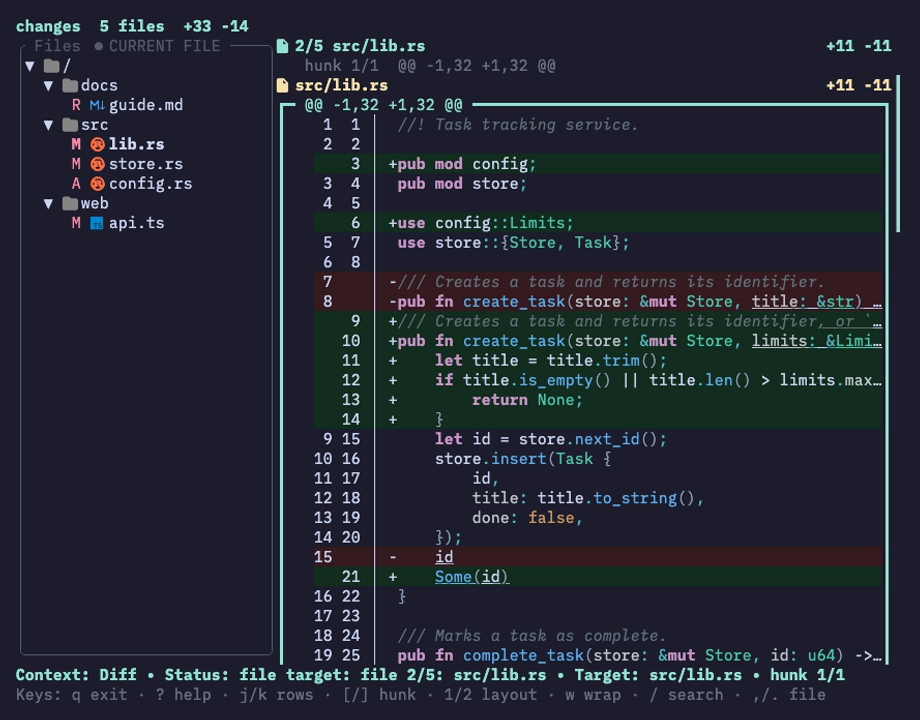

<h1 align="center">
   Revia
</h1>

<p align="center">
  
</p>

Revia is a terminal UI for reading Git diffs as one navigable changeset. Use it
to review your working changes, a commit, a range, or a patch from a coding
agent before you accept them, without leaving the terminal or touching the
repository.

<p align="center">
  
</p>

## Why Revia?

- **Review without side effects.** Revia reads diffs and never stages, edits,
  or commits. Opening a review is safe even in the middle of an agent's work.
- **Read the change as a whole.** Files and hunks appear in Git order in one
  scrollable stream. Jump by hunk or file, and the file rail follows along.
- **Choose exactly what to review.** Working-tree changes (including untracked
  files), the index, one commit, a revision range, or any unified patch from a
  file or stdin.
- **See the evidence, not the noise.** Syntax highlighting, word-level change
  highlights, and split or stacked layouts that adapt to the terminal width.
- **Keep your place.** Resizing, switching layouts, wrapping lines, or
  reloading keeps you on the same file and hunk.

## Getting started

### Requirements

- macOS or Linux. Windows is not supported.
- Git, for Git-based inputs.
- Rust 1.90 or later with Cargo.

### Install

Install from crates.io:

```sh
cargo install revia --locked
```

To install the latest unreleased source instead:

```sh
cargo install --git https://github.com/choplin/revia --locked
```

Or build from a local clone:

```sh
git clone https://github.com/choplin/revia
cd revia
cargo install --path . --locked
```

Check that `revia` is on your `PATH`:

```sh
revia --version
```

Expected output:

```text
revia 0.1.0
```

### Review your first change

Run Revia inside any Git repository that has uncommitted changes:

```sh
revia
```

`revia` with no arguments is the same as `revia git changes`: it shows all
staged, unstaged, and untracked changes relative to `HEAD`. The review opens
on the first file. Then:

1. Press `]` and `[` to move between hunks, and `.` and `,` to move between
   files.
2. Press `/`, type a word, and press `Enter` to search the whole diff. Press
   `n` and `N` to move through the matches.
3. Press `?` to see every key available where you are.
4. Press `q` to quit. Your repository is unchanged.

<p align="center">
  
</p>

## Choose what to review

| Command | Reviews |
| --- | --- |
| `revia git changes` | Staged, unstaged, and untracked changes relative to `HEAD` (default) |
| `revia git staged` | Changes staged in the index |
| `revia git unstaged` | Tracked changes not yet staged |
| `revia git revision <REVISION>` | The patch introduced by one commit |
| `revia git range <A..B\|A...B>` | A two-dot or three-dot revision range |
| `revia patch <FILE>` | A unified patch file |
| `revia patch -` | A unified patch read from stdin |

Shortcuts are available for common cases: `revia HEAD~1` reviews one revision,
`revia main...feature` reviews a range, and `revia -` reads a patch from stdin.
For example, to review a GitHub pull request:

```sh
gh pr diff 123 | revia -
```

Useful options:

- `--repo <PATH>` inspects another repository instead of the current directory.
- `-U <N>` / `--context <N>` sets the number of unchanged lines around each
  hunk (default: 3).
- `--print` writes the captured patch to stdout instead of opening the UI. Revia
  also prints instead of opening the UI when stdout is not a terminal.

Set `NO_COLOR` to any non-empty value to turn off colors. Markers, line
numbers, and text styles still distinguish added, removed, and selected lines.

Git inputs require a repository with at least one commit.

## Keyboard reference

Press `?` in Revia for the complete, context-aware list.

| Keys | Action |
| --- | --- |
| `j` / `k`, `↑` / `↓` | Move by row |
| `f` / `Space`, `b` · `d` / `u` | Page down / up · half-page down / up |
| `g` / `G` | Jump to the first / last row |
| `[` / `]` | Previous / next hunk |
| `,` / `.` | Previous / next file |
| `/`, then `n` / `N` | Search the diff, then move through matches |
| `1` / `2` / `0` | Split / stacked / automatic layout |
| `s`, `Tab` | Show the file list, switch focus between it and the diff |
| `w` · `m` | Toggle line wrapping · toggle file headers |
| `=` / `-` | Show more / less diff context |
| `r` | Reload the input |
| `?` · `q` | Help · quit |

<p align="center">
  
</p>

## Project status

Revia 0.1.0 is a read-only diff viewer. It does not yet support writing review
comments or sending feedback back to an author or agent.

Planned for later releases (subject to change):

- **Review threads on hunks.** Comment on a hunk and discuss it in a thread.
  Threads are anchored to the reviewed commit, so they keep their meaning after
  the code changes, and track open, resolved, and needs-attention states.
- **Thread triage.** Filter the review to open or needs-attention threads, and
  see all threads in one rollup view.
- **AI agents as reviewers.** Let coding agents take part in the same threads,
  discussing changes among themselves while you step in where a decision is
  needed.
- **Review export.** Export the threaded review in a form agents and other
  tools can consume.
- **Structural diff (under consideration).** An optional AST-aware view on top
  of the line-based diff.

## Development

Revia is written in Rust. A Nix flake provides the development shell:

```sh
nix develop
cargo test
```

Developer documentation starts at [docs/architecture.md](docs/architecture.md).

## License

Licensed under the [MIT License](LICENSE).
